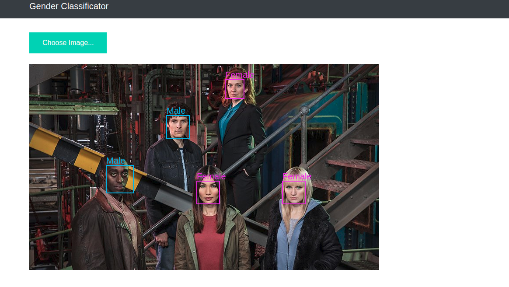

# Web Rest Api face detection with gender classification

[Live application here](https://face-gender-detection.herokuapp.com/)

### Deep Learning Pytorch and Flask as Web App
Here we will present a simple method to take a Pytorch model and create Python Flask Web App.

Specifically, we will:

  - Load a Pytorch model into memory so it can be efficiently used for inference
  - Use the Flask web framework to create an endpoint for our API
  - Use the web api for our UI screen
  - Make predictions using our model, and return the results to the UI
  - Configure our development environment

We’ll be making the assumption that Pytorch is already configured and installed on your machine. If not, please ensure you install Pytorch using the official install instructions. We’ll need to install Flask, it is a Python web framework, so we can build our API endpoint. We’ll also need requests so we can consume our API as well.

Also we will use the requirements file. We use it to simple load dependencies. We must to use the below command to load dependencies
```sh
 $ pip install -r requirements.txt
```

### Create your Pytorch Rest Api
We create a app.py class and we use a model trained with the database [Labeled Faces in the Wild (LFW)](http://vis-www.cs.umass.edu/lfw/lfw.pdf) and a [MobileNetV2](https://arxiv.org/abs/1801.04381) image model. For implementation details I used my custom Pytorch library [Pytorchlib](https://github.com/MarioProjects/pytorchlib).

We created one endpoint service 'predictModel'. Firstly, We are recording the pictures from come to client with Javascript and then we send the path and a query to our Python server, to our 'predictModel' endpoint (see model.js). Then the endpoint function gets fired and we:

  - Load the image and detect the faces via [face_recognition api](https://github.com/ageitgey/face_recognition).
  - If there are no faces in the image -> finish and send a simple message to client.
  - If there are faces -> iterate over each face, crop the faces with the coordinates proportioned by face_recognition and do the proper transformations to next do a forward with the cropped and preprocessed face to our model.
  - Get the gender predicction info and the bounding box coordinates and store it into a object.
  - After process all the faces, send back the information acumulated to the web client.

Finally the client will iterate over the faces returned and will draw via canvas a box with the text of gender predicted for each box coordinates (each face).

## Starting the Keras Server
The Flask + Pytorch server can be started by running:
```sh
 $ python app.py
```

Note: For Free Heroku account only 500MB of space will be allocated, GPU version of pytorch takes huge space. So, use CPU version of pytorch for Inference. 



We have successfully called the Pytorch REST API and obtained the model’s predictions via Python and we have achieved successful estimates :)
